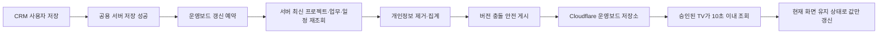

# TV 운영보드 CRM 실데이터 자동 반영 설계

## 목표

CRM 공용 서버에 저장된 프로젝트, 업무지시, 담당자별 성과, 일정 데이터를 별도 샘플이나 수동 입력 없이 TV 운영보드에 표시한다. 사용자가 CRM에서 저장을 완료하면 승인된 TV 화면이 최대 10초 안에 새 자료를 받도록 한다.

## 현재 문제

- TV는 서버에 마지막으로 게시된 스냅샷만 표시한다.
- CRM의 `현재 운영보드 TV에 게시` 또는 `1분마다 자동 게시 시작`을 사용자가 직접 실행해야 한다.
- 자동 게시는 CRM 프로그램이 실행 중일 때만 유지되고, 재시작 후 다시 켜야 한다.
- 여러 사용자가 연속으로 게시하면 버전 충돌로 자동 게시가 중지될 수 있다.
- 따라서 CRM 서버의 최신 데이터와 TV에 표시되는 값 사이에 차이가 생길 수 있다.

## 표시할 실제 데이터

- 프로젝트: 프로젝트명, 담당자, 시작일, 마감일, 진행률, 상태
- 업무지시: 전체 건수, 진행 상태, 검수 완료, 검수 대기, 보완 요청, 기한 초과
- 담당자 성과: 배정 건수, 검수 완료 건수, 완료율, 기한 초과 건수
- 일정: 오늘 일정, 이번 주 일정, 담당자, 시작·종료 시각, 진행 상태
- 성과 시각화: 전체 프로젝트 진행률, 프로젝트 건강도, 주간 완료 추이, 다가오는 마감
- 공지 및 화면 편성: 기존 관리자 설정을 유지

고객 연락처, 주소 원문, 출입정보, 인증정보는 TV 게시 데이터에 포함하지 않는다.

## 검토한 방식

### 1. TV에서 CRM/Firebase를 직접 조회

가장 빠르게 보일 수 있지만 TV 기기에 CRM 인증정보가 필요하고 권한 분리가 무너진다. 사용하지 않는다.

### 2. CRM 프로그램의 기존 1분 자동 게시만 개선

기존 구조를 많이 재사용할 수 있지만 관리자가 자동 게시를 켜야 하고 프로그램 종료 시 멈춘다. 단독 해결책으로 사용하지 않는다.

### 3. 저장 성공 이벤트와 백그라운드 재조정을 결합한 자동 게시

추천 방식이다. CRM 서버 저장 성공 후 게시를 예약하고, 로그인된 CRM이 주기적으로 서버 최신 상태를 재확인한다. TV는 기존 읽기 전용 토큰과 중계 서버를 그대로 사용한다.

## 확정 구조

### CRM 자동 게시

- 로그인 완료 후 자동 동기화를 시작한다.
- 프로젝트, 업무지시, 일정 저장이 성공하면 짧게 디바운스하여 한 번만 게시한다.
- 여러 저장이 연속되면 중복 요청을 합친다.
- 게시할 때 로컬 편집 상태가 아니라 공용 서버에서 다시 읽은 최신 자료를 사용한다.
- 저장 이벤트를 놓친 경우를 위해 60초마다 재조정한다.
- 로그아웃 또는 인증 변경 시 즉시 중지한다.

### 버전 충돌 처리

- 게시 전 현재 서버 게시 버전을 조회한다.
- 충돌이 발생하면 최신 버전을 다시 읽고 스냅샷을 한 번 재생성하여 재시도한다.
- 계속 충돌하거나 권한이 없으면 기존 TV 화면을 유지하고 CRM에 상태를 표시한다.
- 실패를 성공으로 표시하지 않는다.

### TV 갱신

- 웹 TV는 10초 간격으로 게시 버전을 확인한다.
- 버전이 바뀐 경우에만 모델과 편성을 교체한다.
- 현재 보고 있던 장면이 편성에 남아 있으면 장면 위치를 유지한다.
- 연결 장애 시 마지막 정상 화면을 유지하고 연결 확인 문구만 표시한다.
- 다시 연결되면 사용자 조작 없이 최신 버전을 받는다.

## 화면과 운영 상태

CRM 회사 운영보드에는 다음 상태만 간단히 표시한다.

- `실시간 반영 중`
- 마지막 서버 저장 시각
- 마지막 TV 게시 성공 시각과 버전
- `반영 대기`, `권한 확인`, `연결 확인 필요`
- 수동 `지금 동기화` 버튼

기존 BRING CRM의 흰색 카드, 파란 강조색, 토스형 정보 위계를 유지한다. 기존 프로젝트 로드맵과 TV 장면 디자인은 변경하지 않고 데이터 연결과 상태 표시만 개선한다.

## 데이터 정합성

- 프로젝트 진행률은 연결된 업무지시가 있으면 업무 진행률 평균을 사용하고, 없으면 프로젝트 자체 진행률을 사용한다.
- 담당자 성과의 완료는 `검수 완료(done)`만 집계한다.
- 제출 또는 검수 대기는 완료로 집계하지 않는다.
- 기한 초과는 마감일이 지났고 검수 완료가 아닌 업무만 집계한다.
- 동일 업무 ID가 여러 번 조회되면 가장 최근 `updatedAt` 값을 사용한다.
- 일정은 취소 상태를 제외하고 오늘 및 이번 주 범위만 게시한다.

## 오류 처리

- CRM 서버 조회 실패: 게시하지 않고 TV의 마지막 정상 자료 유지
- 중계 서버 오류: 지수형 재시도, 마지막 정상 자료 유지
- 인증 만료: 자동 게시 중지, 재로그인 안내
- 권한 부족: 자동 게시 중지, 관리자 권한 확인 안내
- 게시 버전 충돌: 최신 버전 재조회 후 1회 자동 재시도
- 데이터 검증 실패: 잘못된 스냅샷을 게시하지 않고 항목명을 포함한 오류 기록

## 테스트와 완료 기준

1. 프로젝트 진행률을 변경해 저장하면 10초 안에 TV 값이 바뀐다.
2. 업무지시를 완료 처리하면 담당자 완료 수와 프로젝트 진행률이 함께 바뀐다.
3. 오늘 일정을 추가·수정하면 시간표 장면에 반영된다.
4. CRM을 재실행해도 로그인 후 자동 반영이 다시 시작된다.
5. 두 사용자가 연속 저장해도 버전 충돌로 영구 중지되지 않는다.
6. 인터넷이 잠시 끊겨도 TV는 마지막 정상 화면을 유지하고 재연결 후 자동 복구한다.
7. TV 게시 JSON에 고객 연락처, 상세 주소, 출입정보, 인증정보가 없다.
8. 기존 CRM 및 Worker 테스트가 모두 통과한다.

## 범위 밖

- Google Calendar 연동
- TV에서 CRM 데이터 수정
- 고객 개인정보의 TV 표시
- 별도의 유료 실시간 메시지 서비스 도입
- 기존 CRM 로드맵·프로젝트 데이터 구조 변경
