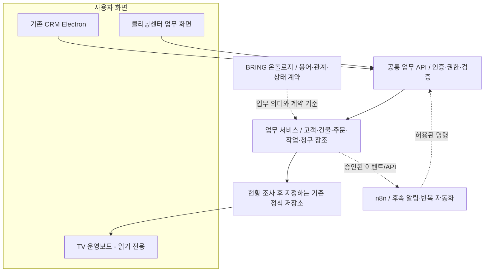

# BRING CRM·클리닝센터·TV 공통 플랫폼 설계

상태: 사용자가 승인한 구현 기준. 로컬 코드·테스트 작업을 진행 중이며, 운영 배포·실데이터 이관은 별도 승인 대상이다.

## 1. 배경과 문제 정의

BRING 저장소에는 Electron 기반 `desktop-crm`, `functions` Firebase Functions, `company-site`, `crm-ai-worker`, `cloudflare-worker`, `apps-script`, TV/사이니지 구성 및 관련 규칙·운영 문서가 함께 있다. CRM에는 고객·건물·작업·계약·청구 기능이 이미 있으며, 클리닝센터 화면 변경도 현재 진행 중이다. 기존 CRM 데이터를 보존하고 별도 클리닝 업무 화면과 TV 운영보드에 연결해야 한다.

위험은 각 화면이 자체 저장 형식·권한·상태 규칙을 만들거나, 새 백엔드가 기존 원본을 확인하지 않고 전체 데이터를 이전하는 것이다. 이 설계는 현재 저장 경로를 조사한 후 공통 계약을 만들고 기능별로 점진 연결한다. 기존 데이터를 한 번에 재작성하지 않는다.

## 2. 목표 및 범위

### 목표

1. CRM 고객·건물·협력업체를 클리닝센터 주문과 식별자 기준으로 연결한다.
2. 접수부터 견적, 배정, 현장 기록, 검수, 완료까지의 단일 업무 흐름을 제공한다.
3. 화면에서 독립적으로 데이터 규칙을 구현하지 않도록 공통 업무 API/서비스 계약을 둔다.
4. TV에는 권한을 제한한 집계·상태만 노출한다.
5. 업무 용어와 관계를 얇은 BRING 온톨로지/용어 사전으로 정의한다.
6. n8n은 API가 안정된 뒤 비핵심 알림·반복 자동화에만 연결한다.

### 이번 설계의 범위

- 기존 CRM과 작업 중인 클리닝센터 화면 사이의 주문·고객·건물·작업 연결
- 기존 인증, 서버 함수, 저장소 및 규칙의 실제 소유권 조사
- 공통 데이터 계약·상태 전이·권한·감사 이력
- TV 공개용 집계 경계
- 단계적 검증·전환·복구 기준

### 범위 밖

- 전체 Firebase/Cloudflare/Apps Script를 새 기술로 일괄 교체
- 데이터베이스 전체 마이그레이션 또는 기존 레코드 자동 병합
- 청구·입금 장부를 대체하는 별도 회계 원장 생성
- n8n을 주문·결제의 기준 저장소로 사용
- 승인되지 않은 운영 배포, 권한 확장, 실데이터 일괄 수정
- 전사 모든 업무를 포괄하는 완전한 지식 그래프 구축

## 3. 선택한 아키텍처와 대안

### 선택: 공통 API/업무 서비스 + 기존 데이터의 점진 연결

CRM과 클리닝센터는 공통 API의 데이터 계약과 서버 검증을 사용한다. TV는 읽기 전용 집계 모델만 소비한다. 기존 저장 경로는 조사 후 기능별로 서버의 단일 쓰기 경로를 정한다. 온톨로지는 개념·관계·상태·용어를 명시하며 실행 저장소를 대신하지 않는다. n8n은 공통 API를 호출하는 보조 자동화 계층이다.

### 검토한 대안

- 화면별 기존 DB 직접 접근: 초기 구현은 쉽지만 중복·권한·상태 의미가 갈라지므로 신규 클리닝 주문의 기본 방식으로 삼지 않는다.
- 새 백엔드로 전면 재구축: 일관성 잠재력은 높으나 데이터 이관·운영 위험과 회귀 범위가 과도해 현재 첫 단계에서는 선택하지 않는다.

## 4. 논리 구성



현재 구현은 Firebase Functions의 `cleaningOrdersApi`를 통해 신규 주문 원본(`crmCompany/cleaningOrders`)을 저장하며, 기존 CRM 고객·건물 ID를 참조한다. 목록 API는 생성시각·주문 ID 복합 커서로 200건씩 반환하며 동시각 주문도 빠짐없이 페이지를 잇는다. 업무지시는 선택적 `cleaningOrderId` 참조로 연결한다. TV는 `crmCompany/wallboard/cleaningOperations`의 집계만 읽는다. 이 구현이 기존 모든 CRM 기능을 공통 API로 이관했다는 뜻은 아니며, 미연결 경로는 단계적으로 구분한다.

## 5. 핵심 도메인과 온톨로지 초안

### 개념

- `Customer`: 기존 CRM의 고객/건물주/연락 담당자 정식 ID
- `Building`: 기존 CRM 정식 건물 ID 및 상태
- `Space`: 건물에 속한 층·호실·공용 공간. 아직 정식 공간 기능이 없으면 확인 후 확장하며, 주소 문자열로 공간을 대체하지 않는다.
- `CleaningOrder`: 고객 요청, 서비스 범위, 연결된 건물/공간을 나타내는 주문
- `Quote`: 주문에 대한 가격 제안·승인 이력. 기존 견적 형식을 재사용 가능한지 조사한다.
- `WorkExecution`: 일정, 배정, 작업 상태 및 실제 수행 기록
- `ChecklistResult`: 작업 단계별 결과와 확인자
- `Evidence`: 사진/첨부의 메타데이터와 보안 저장 참조. 공개 URL이나 인증정보를 주문 데이터에 직접 넣지 않는다.
- `Invoice` / `Receipt`: 기존 청구·입금 장부의 레코드를 참조한다. 클리닝 주문이 이중 장부를 만들지 않는다.
- `User` / `Partner`: 기존 내부 사용자·협력업체 식별 체계를 재사용한다.

### 관계

```text
Customer 1 ── N Building
Building 1 ── N Space
Customer 1 ── N CleaningOrder
CleaningOrder N ── 1 Building; 0..N Space
CleaningOrder 1 ── N QuoteRevision
CleaningOrder 1 ── N WorkExecution
WorkExecution 1 ── N ChecklistResult / Evidence
CleaningOrder 0..N ── Invoice ── 0..N Receipt
WorkExecution N ── 1 User 또는 Partner
```

모든 관계는 정식 ID를 사용한다. 이름·전화번호·주소를 조인 키로 쓰지 않는다. 건물 미연결 주문은 제한된 임시 상태로 허용할 수 있지만, 중복 후보와 연결 책임자를 표시하고 식별 전 TV 고객별 집계에 포함하지 않는다.

### 최소 용어 사전

`접수`, `확인중`, `견적대기`, `승인대기`, `작업대기`, `작업중`, `검수대기`, `보완요청`, `완료`, `취소`의 의미와 허용 전이를 단일 계약에서 관리한다. 실제 기존 CRM 상태와 대응표를 만든 뒤 신규 상태를 적용한다. 기존 상태값을 의미 확인 없이 재해석하지 않는다.

## 6. 주문 및 작업 상태 설계

권장 정상 흐름:

```text
접수 → 확인중 → 견적대기 → 승인대기 → 작업대기 → 작업중
     → 검수대기 → 완료
                       └→ 보완요청 → 작업중/검수대기
```

- 취소는 접수부터 작업 전까지 정책상 허용된 상태에서만 가능하며 사유·행위자·시각을 남긴다.
- 견적 승인과 작업 완료는 서로 다른 행위다.
- 작업자가 완료 제출을 해도 관리자 검수 전까지 `검수대기`다.
- 완료를 위해 필요한 체크리스트와 증거 유형은 서비스 템플릿으로 정의한다. 모든 업무에 사진을 강제하지 않고, 필수 조건을 명시한다.
- `완료` 전이는 서버가 같은 주문 ID·건물 ID·서비스 유형의 결과보고서를 다시 읽어 검증한 경우에만 허용한다. 해당 작업 회차의 `작업중` 시작 이후 갱신된 보고서여야 하고 필수 체크리스트 키가 모두 있어야 한다. `완료` 항목마다 전·후 사진 참조(ID와 Drive 파일 ID), `못 함` 항목에는 사유가 필요하며, 적어도 한 항목은 수행되어야 한다. `일부` 항목은 기존 CRM 결과보고서 규칙과 같이 사진을 강제하지 않는다.
- 검수 시점의 증거가 바뀌는 경합을 막기 위해 `검수대기` 진입 시점부터 연결 보고서의 생성·수정·연결 해제를 Firebase 규칙에서 막는다. 검수자가 `보완요청`으로 돌리면 편집을 다시 허용하고, 작업 재개 후 재검수 때 최신 작업 회차 증거를 다시 확인한다.
- 이 전제 위반 또는 보고서 조회 실패 시 주문 상태·revision·이력은 쓰지 않고 `cleaning_order_completion_evidence_required`로 거부한다. 검수 대기·완료 중인 주문의 보고서는 Firebase 규칙에서 잠가 근거를 보존한다. 보고서 검색은 `cleaningOrderId` 인덱스와 최근 50건 제한을 사용한다.
- 서버가 전이 가능성·역할·레코드 버전을 확인한다. 화면의 버튼 숨김은 권한 제어가 아니다.
- 삭제 대신 취소/보관 및 이력을 사용한다.

## 7. 화면 책임과 사용자 흐름

### CRM

- 고객·건물·협력업체의 정식 원본과 기존 계약·견적·청구 업무 유지
- 고객/건물 상세에서 연결된 클리닝 주문과 이력을 탐색
- 연결되지 않은 고객·건물, 승인대기, 보완요청을 확인
- 정식 원본 변경 시 기존 canonical 저장/버전/감사 경로를 우선 재사용

### 클리닝센터

- 주문 목록 및 상태별 작업 큐 제공
- 상단 현황은 현재 CRM에서 서버로 불러온 정식 주문 데이터만 집계한다. 요약은 `접수·검토`, `견적·승인 대기`, `예정·진행 중`, `결과 검토 대기`, `보완 요청`, `완료`, `기한 초과` 7개 지표로 분리하고, 선택하면 해당 목록을 필터링한다.
- API 페이지가 더 있으면 현재 불러온 일부 건수임을 표시한다. 기한 초과는 완료·취소가 아니면서 유효한 희망일이 오늘보다 이전인 주문으로 정의하고, 상태별 건수와 중복될 수 있음을 명시한다. 로딩·조회 실패·조회된 0건을 서로 다른 상태로 보여 주며, 조회 실패를 0건으로 표시하지 않는다.
- 주문이 200건을 넘으면 `(createdAt, orderId)` 커서로 다음 페이지를 불러오고, 검색·상태 필터 및 기존 레코드를 보존한다. 같은 시각 주문도 ID를 보조 정렬 기준으로 사용한다.
- 기존 고객·건물 검색/선택, 미연결 사유와 확인 작업 제공
- 서비스 유형·옵션·현장 조건·희망 일정·담당자 입력. 서비스 유형은 입주·퇴실·공용부·계단·기타 중 명시적으로 선택하게 하고, 오분류를 막기 위해 접수 기본값을 두지 않는다.
- 견적 검토/승인, 작업 배정, 현장 체크리스트/사진, 검수/보완 처리
- 각 저장은 공통 API를 사용하고 저장 중·저장 성공·충돌·오프라인 대기를 구분 표시
- 기존 사용자 권한과 회사 CRM 디자인 토큰을 사용하며 전체 CRM을 새로 복제하지 않는다.

### TV

- 전체 주문 건수, 상태별 건수, 기한 임박, 완료율 등 집계만 표시
- 원본 주문 컬렉션을 TV 계정에 읽기 허용하지 않는다. Firebase 서버 함수가 별도 projection 경로에 개인정보 없는 집계를 쓰고, TV 서버 계정은 그 projection만 읽는다.
- 주문 생성·단계 변경 API는 저장 완료 직후 projection을 다시 계산해 갱신하고, 갱신 성공 여부를 응답에 포함한다. RTDB write trigger는 재시도·다른 서버측 변경의 복구 경로로 유지한다. API 저장 성공 뒤 projection 갱신이 실패해도 이미 완료된 주문 변경을 실패로 응답하지 않는다.
- projection에는 고객명·전화번호·상세주소·개인 메모·주문 ID·담당자 식별자·증거 참조를 넣지 않는다.
- 합계 생성 시각, 원본 갱신 시각, 마지막 정상 스냅샷 여부를 표시
- 실패 시 0으로 위장하지 않고 마지막 정상 게시본/오류 시각을 유지한다.

## 8. 데이터·API 계약 요구사항

API 계약은 현재 Firebase Functions `cleaningOrdersApi`에서 인증 후 주문 목록·생성·상태 변경으로 구현 중이다. 아래의 견적·작업 배정·체크리스트 등은 별도 계약 구현과 검증이 필요한 목표 범위이며, 목록 페이지네이션은 `beforeCreatedAt`과 `beforeId`를 함께 받는다.

1. 고객·건물 검색 및 정식 ID 조회
2. 주문 생성·상세 조회·수정
3. 견적 초안 및 승인 전이
4. 작업 일정·담당 배정·상태 전이
5. 체크리스트 및 증거 메타데이터 추가
6. 검수 승인·보완 요청
7. CRM 고객/건물 타임라인용 주문 요약
8. TV 공개용 집계 스냅샷 조회/게시

각 계약은 입력 스키마, 출력 스키마, 오류 코드, 역할 요구사항, 멱등성, 버전/충돌 정책, 개인정보 분류를 갖는다.

### 불변 조건

- 서버가 사용자 인증·회사/역할 권한·상태 전이·필수 관계를 검증한다.
- 재전송 가능한 쓰기는 `requestId` 등 멱등 키로 중복 실행을 방지한다.
- 경쟁 수정은 버전 조건부 쓰기/트랜잭션으로 감지하고 조용히 덮어쓰지 않는다.
- 감사 이력은 행위자·시각·대상·행위·변경 요약을 기록하되 민감 원문을 불필요하게 복제하지 않는다.
- 사진 파일은 기존 Storage 접근 제어를 따른다. 공개 링크와 토큰을 TV/API 로그에 싣지 않는다.
- `Invoice`와 `Receipt`는 기존 원장 계약을 따르고, 새 주문 기능이 승인 상태나 실제 입금을 임의 작성하지 않는다.

## 9. n8n 자동화 경계

### 허용 후보

- 주문 접수 이벤트의 담당자 알림
- 일정 전 리마인드
- 검수대기·보완요청 장기 체류 알림
- 일일 업무 요약 생성 및 링크 전달
- 외부 폼/메일 수신자료를 승인 대기함에 전달

### 제외

- 고객/건물/주문 정식 레코드 직접 수정
- 승인되지 않은 견적·청구·입금 확정
- 중복 안전성이 없는 상태 전이
- AI가 제안한 내용을 사용자 확인 없이 CRM 원본에 반영

n8n 운영 설정은 저장소와 현재 확인된 배포 자료에서 확인되지 않았다. 따라서 신규 도입으로 간주한다. webhook 서명·서비스 계정 최소 권한·비밀 저장소·재시도 정책·dead-letter/오류 알림·멱등 키·실행 이력 보존 기간을 요구한다. n8n 장애가 주문 저장을 막지 않아야 한다.

## 10. 보안·개인정보·운영

- 고객 연락처, 상세 주소, 출입방법, 개인 메모는 TV·분석 이벤트·불필요한 로그에서 제외한다.
- 역할은 최소한 관리자/운영담당/작업담당/협력업체/TV 읽기 권한으로 구분하고, 실제 기존 계정 모델과 대조한다.
- 협력업체는 배정된 작업에 필요한 정보만 읽고, 다른 고객/건물 조회는 차단한다.
- 사진 보관·삭제·다운로드 감사 및 개인정보 포함 이미지 안내를 정의한다.
- AI 자동 분류/요약은 제안으로만 제공하고 사람이 승인하기 전에는 공식 상태나 고객 발송에 사용하지 않는다.
- 각 외부 연동의 장애·속도 제한·인증 만료를 정상 업무 저장과 분리한다.

## 11. 단계별 구현 및 검수 계획

### 0단계 — 현행 경로 조사

화면별 저장소, 읽기·쓰기 함수, Firebase 규칙, Cloudflare Worker, Apps Script 사용처, TV 게시 경로, 테스트/운영 데이터 구분을 표로 작성한다. 코드·실데이터 변경은 하지 않는다.

### 1단계 — 도메인/API 기준 확정

고객·건물·주문·작업·증거·청구 관계, 상태 전이표, 권한표, API 스키마, 개인정보 표, 기존 상태 매핑을 확정한다. 대표 시나리오 테스트 데이터를 정의한다.

### 2단계 — 얇은 수직 흐름

합성 고객/건물 한 건과 클리닝 주문 한 건으로 CRM에서 연결을 확인하고, 클리닝센터에서 접수·배정·상태 변경을 실행하며 서버에 저장되는지 검증한다. 기존 고객/건물 데이터는 마이그레이션하지 않는다.

### 3단계 — 현장 실행·검수

체크리스트·사진 메타데이터·보완 요청·완료 이력을 연결한다. 권한·충돌·중복 제출·오프라인 복구를 테스트한다.

### 4단계 — CRM 통합·TV 프로젝션

CRM 고객/건물 타임라인에 주문 요약을 제공한다. TV는 공개 스키마 화이트리스트로 상태 집계를 표시한다. 다른 기존 TV 장면과 새로고침 동작을 회귀 검수한다.

### 5단계 — 제한적 운영 확인 및 자동화

운영 데이터와 테스트 데이터 분리, 백업/복구 리허설, 권한·보안 검토, 제한 사용자 확인을 수행한다. 별도 배포 승인 전에는 운영 설정을 바꾸지 않는다. n8n은 API·이벤트가 안정된 뒤 알림 한 종류부터 추가한다.

## 12. 출시·완료 판정

개발 완료는 다음 증거로 판단한다.

- 주문 1건이 고객/건물과 정식 ID로 연결되고 CRM 및 클리닝센터 양쪽에서 일치한다.
- 접수→견적→배정→현장 기록→검수/보완→완료가 서버 규칙대로 진행된다.
- 권한 없는 상태 변경, 타 고객 조회, 중복 제출, 버전 충돌 테스트가 차단된다.
- 파일/사진 접근 권한과 개인정보 최소화가 확인된다.
- TV 화면은 허용된 집계만 보여주고 새 데이터/오류/마지막 정상 갱신을 구분한다.
- 기존 CRM 저장, 계약, 청구 원장, TV 장면 회귀 테스트가 통과한다.
- 테스트/운영 환경별 검증 근거, 복구 절차 및 승인자가 기록된다.

운영 배포·기존 데이터 자동 병합·Firebase 규칙 변경·n8n 운영 활성화는 설계 승인만으로 자동 허가되지 않는다. 필요한 권한과 별도 검수/승인을 거친다.

## 13. 설계 자체 점검 및 미확정 조사 항목

- 기존 Firebase 데이터 경로별 정식 쓰기 주체와 규칙은 0단계에서 확인한다.
- CRM 화면에서 진행 중인 클리닝센터 미커밋 변경은 사용자 작업으로 보존하고, 이 설계 문서만 추가한다.
- 현행 구조와 목표 구조를 별도 그림으로 유지하며 아직 구현되지 않은 경로를 현재 상태로 표현하지 않는다.
- 청구·입금은 승인된 기존 장부를 참조한다. 주문에 돈 상태 문자열을 복제하지 않는다.
- 온톨로지는 얇은 JSON/문서 계약 수준부터 시작하고, 별도 그래프 DB나 AI 추론 플랫폼을 이번 범위에 도입하지 않는다.
- n8n은 저장소 및 운영 환경에서 존재 여부가 확인되지 않았으므로 신규 의존성으로 간주한다.
- UI 상세 화면·목록·모바일 작업자 요구는 기존 클리닝센터 화면/사용자 흐름과 대조해 구현 계획에서 확정한다.
